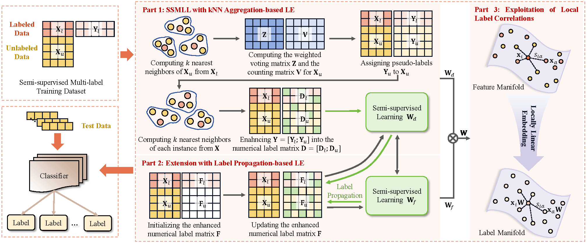

# SMLE
This is the official code for the paper Q. Ye, J. Zhang, H. Wu, T. Gu, C. L. P. Chen and J. Long, "SMLE: Semi-Supervised Multi-Label Learning with Label Enhancement," in IEEE Transactions on Knowledge and Data Engineering, doi: 10.1109/TKDE.2025.3579536. (https://ieeexplore.ieee.org/abstract/document/11034724).

- Authors: Qianzhi Ye, Jia Zhang, Hanrui Wu, Tianlong Gu, C. L. Philip Chen, Jinyi Long.

## Preliminaries
This code was developed and tested with: `Matlab R2020b`

## Experiments
Experiments can be started by running the `demo` script.

## Cite
Please cite our paper if you use this code in your own work:

    @ARTICLE{11034724,
    author={Ye, Qianzhi and Zhang, Jia and Wu, Hanrui and Gu, Tianlong and Chen, C. L. Philip and Long, Jinyi},
    journal={IEEE Transactions on Knowledge and Data Engineering}, 
    title={SMLE: Semi-Supervised Multi-Label Learning with Label Enhancement}, 
    year={2025},
    doi={10.1109/TKDE.2025.3579536}}

If you have any questions about the code or the paper, we are happy to help!
